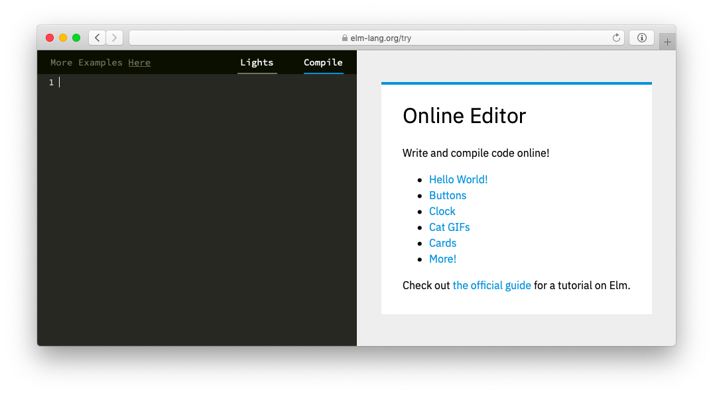

<!--
# The Elm Architecture
-->

# The Elm Architecture 

<!--
The Elm Architecture is a pattern for architecting interactive programs, like webapps and games.
-->
<!-- TODO -->
<!-- 元の文章：
The Elm Architecture は、ウェブアプリケーションを構築するためのシンプルなパターンです。モジュール性やコードの再利用性、テストのしやすさなどに優れています。つまり、複雑なアプリケーションを作るときでも、安心してリファクタリングしたり機能を追加できるようにしてくれるのです。
-->
The Elm Architecture is a pattern for architecting interactive programs, like webapps and games.

<!--
This architecture seems to emerge naturally in Elm. Rather than someone inventing it, early Elm programmers kept discovering the same basic patterns in their code. It was kind of spooky to see people ending up with well-architected code without planning ahead!
-->
<!-- TODO -->
<!-- 元の文章：
このアーキテクチャは、Elmの歴史の中から自然に生まれてきました。誰かがこれを「発明した」というより、コードの中にこの基本的なパターンが常にあることを初期のElmプログラマが発見したということです。チームで開発している人たちも、The Elm Architecture は新人開発者の教育に特に適していると考えています。The Elm Architecture に従えば、それだけでコードはより良く設計されるようになります。このように、気がついたらおばけみたいにすっと現れていたパターンなのです。
-->
This architecture seems to emerge naturally in Elm. Rather than someone inventing it, early Elm programmers kept discovering the same basic patterns in their code. It was kind of spooky to see people ending up with well-architected code without planning ahead!

<!--
So The Elm Architecture is easy in Elm, but it is useful in any front-end project. In fact, projects like Redux have been inspired by The Elm Architecture, so you may have already seen derivatives of this pattern. Point is, even if you ultimately cannot use Elm at work yet, you will get a lot out of using Elm and internalizing this pattern.
-->
そして、The Elm Architecture はElmでは簡単ですが、どんなフロントエンドプロジェクトにおいても便利なものです。実のところReduxのようなプロジェクトはThe Elm Architecture に着想を得て作られたものなので、このパターンの派生をすでに見たことがある人もいるかもしれません。もしまだ実際のプロジェクトでElmを使うことができないとしても、Elmを使いこのパターンを修得することで得るものは多いでしょう。


<!--
## The Basic Pattern
-->

## 基本的なパターン

<!--
The logic of every Elm program breaks into three parts:
-->
<!-- TODO -->
<!-- 元の文章：
どんなElmプログラムも、次の３つの要素に明確に分割することができるでしょう。
-->
The logic of every Elm program breaks into three parts:

<!--
  * **Model** &mdash; the state of your application
  * **Update** &mdash; a way to update your state
  * **View** &mdash; a way to view your state as HTML
-->

  * **Model** &mdash; アプリケーションの状態
  * **Update** &mdash; 状態を更新する方法
  * **View** &mdash; HTMLとして状態を閲覧する方法

<!--
So I always start with the following skeleton and fill in details for my particular case.
-->
<!-- TODO -->
<!-- 元の文章：
このパターンはとても信頼性が高いので、私はいつも次のような骨組みから始めて、プロジェクトごとの振る舞いに応じて詳細を埋めていくようにしています。
-->
So I always start with the following skeleton and fill in details for my particular case.

```elm
import Html exposing (..)


-- MODEL

type alias Model = { ... }


-- UPDATE

type Msg = ...

update : Msg -> Model -> Model
update msg model =
  ...


-- VIEW

view : Model -> Html Msg
view model =
  ...

```

<!--
That is the essence of The Elm Architecture. We will proceed by filling in this skeleton with increasingly interesting logic.
-->
<!-- TODO -->
<!-- 元の文章：
まさしくこれが The Elm Architecture の本質なのです！　ここからは、面白いロジックでこの骨組みをだんだんと埋めていくことで、説明を進めていきましょう。
-->
That is the essence of The Elm Architecture. We will proceed by filling in this skeleton with increasingly interesting logic.

<!--
# The Elm Architecture + User Input
-->

# The Elm Architecture  + ユーザ入力

<!--
Your web app is going to need to deal with user input. This section will get you familiar with The Elm Architecture in the context of things like:
-->

ウェブアプリケーションではユーザからの入力を扱う必要があるでしょう。この節では、次のような内容について、The Elm Architecture に慣れるようにしていきます。

<!--
  - Buttons
  - Text Fields
  - Check Boxes
  - Radio Buttons
  - etc.
-->

  - ボタン
  - テキストフィールド
  - チェックボックス
  - ラジオボタン
  - そのほか

<!--
We will go through a few examples that build knowledge gradually, so go in order!
-->

いくつかの例を見ながら徐々に知識を深めていきますので、それではこの順番で進めていきましょう！


<!--
## Follow Along
-->

## 本書を読み進めるためにあたって

<!--
The following examples are all available in the online editor:

[](https://elm-lang.org/try)

This editor shows hints in the top left corner:
-->

<!-- TODO -->
The following examples are all available in the online editor:

[](https://elm-lang.org/try)

This editor shows hints in the top left corner:

<video id="hints-video" width="360" height="180" autoplay loop style="margin: 0.55em 0 1em 2em;" onclick="var v = document.getElementById('hints-video'); v.paused ? (v.play(), v.style.opacity = 1) : (v.pause(), v.style.opacity = 0.5)">
  <source src="hints.mp4" type="video/mp4">
</video>

<!--
Hopefully this will be helpful as you work through the upcoming examples!
-->

<!-- TODO -->
Hopefully this will be helpful as you work through the upcoming examples!
