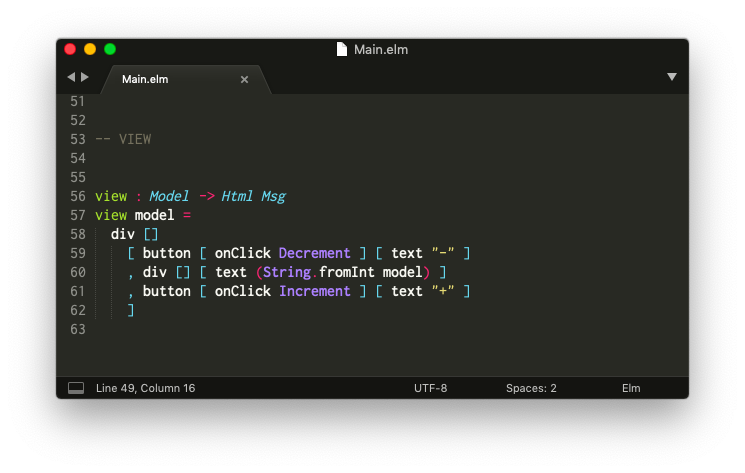

<!--
# Install a Code Editor
-->
# コードエディターをインストールする

<!--
The first step is to get a code editor set up to handle Elm files.
-->
最初のステップは、Elmファイルを扱うためにコードエディターを設定することです。

<!--

-->

<!--
There are a bunch of editor plugins maintained by community members for a broad range of editors. You can check out a list of them [here](https://github.com/elm/editor-plugins).
-->
コミュニティのメンバーによってメンテナンスされている、さまざまなエディター向けのたくさんのプラグインがあります。その一覧を[こちら](https://github.com/elm/editor-plugins)から確認できます。

<!--
It can be tricky to get an editor set up, so for the purpose of this guide, I am going to show how to get set up with Sublime Text in particular. Hopefully this will be helpful for people new to programming or as a backup for people who already have a preferred code editor.
-->
エディターの設定が面倒なものもありますので、このガイド向けにはSublime Textを取り上げて設定方法をご紹介します。この内容がプログラミング初心者の方々の役に立つことや、すでにお気に入りのコードエディターをお持ちの方の補助として役立つことを願っています。

## Sublime Text

<!--
**Step 1:** Download Sublime Text from [here](https://www.sublimetext.com/).
-->
**手順 1:** [こちら](https://www.sublimetext.com/)からSublime Textをダウンロードします。

<!--
**Step 2:** Install the "Elm Syntax Highlighting" plugin.
-->
**手順 2:** "Elm Syntax Highlighting"プラグインをインストールします。

- [Mac](https://github.com/evancz/elm-syntax-highlighting/blob/master/install/mac.md)
- [Linux](https://github.com/evancz/elm-syntax-highlighting/blob/master/install/linux.md)
- [Windows](https://github.com/evancz/elm-syntax-highlighting/blob/master/install/windows.md)

<!--
After going through those steps, it should be possible to open Elm files with syntax highlighting. Keywords like `import` and `type` should be colorful so the code is easier to read.
-->
上記の手順を実施すると、構文の強調表示がなされた状態でElmファイルを開けるはずです。 `import`や`type`のような予約語がカラフルに表示され、それによってコードがより読みやすくなります。

<!--
> **Note:** There are alternatives! Community members have created editor plugins for Atom, Emacs, IntelliJ, Vim, VS Code, and many more. We try to keep [this page](https://github.com/elm/editor-plugins) up to date with all the options!
-->
> **Note:** ほかのエディターを使うのも良いでしょう！コミュニティのメンバーがAtom、Emacs、IntelliJ、Vim、VS Codeなどたくさんのエディター向けにプラグインを作りました。我々はプラグインが利用可能なすべてのエディターを記載して[プラグイン一覧のページ](https://github.com/elm/editor-plugins)を最新の状態に保つようにしています！
