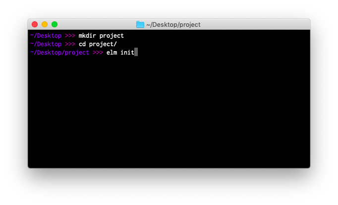

<!--
# Install Elm
-->
# Elmをインストールする

<!--
The previous page described how to install a code editor for Elm, so the next step is to obtain an executable file named `elm`. Here are the **install** links:
-->
前のページでは、Elm用のコードエディターをインストールする方法を説明しましたので、次は`elm` という実行可能ファイルを取得します。こちらが**インストール**用のリンクです。

<!--
- **Mac** - [installer](https://github.com/elm/compiler/releases/download/0.19.1/installer-for-mac.pkg)
- **Linux** - <a href="https://github.com/elm/compiler/blob/master/installers/linux/README.md" target="_blank">instructions</a>
- **Windows** - [installer](https://github.com/elm/compiler/releases/download/0.19.1/installer-for-windows.exe)
-->
- **Mac** - [インストーラー](https://github.com/elm/compiler/releases/download/0.19.1/installer-for-mac.pkg)
- **Linux** - <a href="https://github.com/elm/compiler/blob/master/installers/linux/README.md" target="_blank">インストール手順</a>
- **Windows** - [インストーラー](https://github.com/elm/compiler/releases/download/0.19.1/installer-for-windows.exe)

<!--
After installation is complete, open up the terminal on your computer. It may be called `cmd.exe` or `Command Prompt` on Windows.
-->
インストールが終わったら、コンピューターのターミナルを開いてください。Windowsでは、`cmd.exe`または`コマンドプロンプト`と呼ばれることもあります。

<!--

-->


<!--
Start by navigating to your desktop in the terminal:
-->
ターミナルでデスクトップに移動することから始めます。

<!--
```bash
# Mac and Linux
cd ~/Desktop

# Windows (but with <username> filled in with your user name)
cd C:\Users\<username>\Desktop
```
-->
```bash
# Mac、Linux
cd ~/Desktop

# Windows (<username> にはあなたのユーザー名が入ります)
cd C:\Users\<username>\Desktop
```

<!--
The next step is to get familiar with `elm` command. I personally had a really hard time learning terminal commands, so I worked hard to make the `elm` command nice to use. Let's go through a couple common scenarios.
-->
次のステップは`elm`コマンドに慣れることです。私自身はターミナルのコマンドを覚えるのに本当に苦労したので、`elm`コマンドは使いやすいように頑張って作りました。よく使うコマンドをいくつか見ていきましょう。

<br>

## <span style="font-family:Consolas,'Liberation Mono',Menlo,Courier,monospace;">elm init</span>

<!--
You can start an Elm project by running:
-->
実行するとElmのプロジェクトを開始できます。

```bash
elm init
```

<!--
Try running this command to create an `elm.json` file and a `src/` directory:
-->
このコマンドを実行して、`elm.json`ファイルと`src/`ディレクトリを作ってみてください。

<!--
- [`elm.json`](https://github.com/elm/compiler/blob/master/docs/elm.json/application.md) describes your project.
- `src/` holds all of your Elm files.
-->
- [`elm.json`](https://github.com/elm/compiler/blob/master/docs/elm.json/application.md)には、プロジェクトの情報が書かれています。
- `src/`にはすべてのElmファイルが入っています。

<!--
Now try creating a file called `src/Main.elm` in your editor, and copying in the code from [the buttons example](https://elm-lang.org/examples/buttons).
-->
それでは、エディターで`src/Main.elm`というファイルを作って、[ボタンのサンプル](https://elm-lang.org/examples/buttons)からコードをコピーしてみましょう。


<br>

## <span style="font-family:Consolas,'Liberation Mono',Menlo,Courier,monospace;">elm reactor</span>

<!--
`elm reactor` helps you build Elm projects without messing with the terminal too much. You just run it at the root of your project, like this:
-->
`elm reactor`を使うと、ターミナルを頻繁に操作しなくてもElmプロジェクトをビルドできます。例えば次の例のように、プロジェクトのルートディレクトリで以下のコマンドを入力してみてください。

```bash
elm reactor
```

<!--
This starts a server at [`http://localhost:8000`](http://localhost:8000). You can navigate to any Elm file and see what it looks like. Run `elm reactor`, follow the localhost link, and try to check out your `src/Main.elm` file!
-->
サーバーが[`http://localhost:8000`](http://localhost:8000)で起動します。ここでは任意のElmファイルを確認することができます。`elm reactor`を実行して、localhostへのリンクを開き、`src/Main.elm`ファイルを確認してみてください！


<br>

## <span style="font-family:Consolas,'Liberation Mono',Menlo,Courier,monospace;">elm make</span>

<!--
You can compile Elm code to HTML or JavaScript with commands like this:
-->
次のようなコマンドを使うと、ElmのコードをHTMLやJavaScriptにコンパイルできます。

<!--
```bash
# Create an index.html file that you can open in your browser.
elm make src/Main.elm

# Create an optimized JS file to embed in a custom HTML document.
elm make src/Main.elm --optimize --output=elm.js
```
-->
```bash
# ブラウザで開くことができるindex.htmlファイルを作成します。
elm make src/Main.elm

# 自前のHTMLドキュメントで読み込むために最適化されたJSファイルを作成します。
elm make src/Main.elm --optimize --output=elm.js
```

<!--
Try running these commands on your `src/Main.elm` file.
-->
これらのコマンドを`src/Main.elm`ファイルで実行してみてください。

<!--
This is the most general way to compile Elm code. It is extremely useful once your project becomes too advanced for `elm reactor`.
-->
`elm make`はElmのコードをコンパイルする最も一般的な方法です。`elm reactor`では不十分なほどプロジェクトが複雑になってしまった場合にとても役に立ちます。

<!--
This command produces the same messages you have been seeing in the online editor and with `elm reactor`. Years of work has gone into them so far, but please report any unhelpful messages [here](https://github.com/elm/error-message-catalog/issues). I am sure there are ways to improve!
-->
このコマンドを実行すると、オンラインエディターや`elm reactor`で表示されたものと同じメッセージが表示されます。これまでに長い年月をかけてメッセージを作ってきましたが、わかりにくいメッセージがありましたら[こちら](https://github.com/elm/error-message-catalog/issues)に報告してください。きっと改善できると思います！


<br>

## <span style="font-family:Consolas,'Liberation Mono',Menlo,Courier,monospace;">elm install</span>

<!--
Elm packages all live at [`package.elm-lang.org`](https://package.elm-lang.org/).
-->
Elmのパッケージは全て[`package.elm-lang.org`](https://package.elm-lang.org/)に置かれています。

<!--
Say you look around and decide you need [`elm/http`][http] and [`elm/json`][json] to make some HTTP requests. You can get them set up in your project with the following commands:
-->
例えばHTTPリクエストを組み立てるために[`elm/http`][http]パッケージと[`elm/json`][json]パッケージをプロジェクトに追加したいときは、以下のコマンドでインストールすることができます。

```bash
elm install elm/http
elm install elm/json
```

<!--
This adds these dependencies into your `elm.json` file, making these packages available in your project. That will let you say `import Http` and use functions like `Http.get` in your programs.
-->
このコマンドは`elm.json`に依存関係を追記して、プロジェクトで利用できるようにします。これにより、プログラムで`import Http`できるようになり、`Http.get`のような関数を使うことができます。

[http]: https://package.elm-lang.org/packages/elm/http/latest
[json]: https://package.elm-lang.org/packages/elm/json/latest

<br>

<!--
## Tips and Tricks
-->
## ヒントとコツ

<!--
**First**, do not worry about remembering all this stuff!
-->
**その1**、全てを覚えようとする必要はありません！

<!--
You can always run `elm --help` to get a full outline of what `elm` is capable of.
-->
`elm --help`を使うことで、いつでも`elm`コマンドの使い方の全てを確認できます。

<!--
You can also run commands like `elm make --help` and `elm repl --help` to get hints about a specific command. This is great if you want to check which flags are available and what they do.
-->
また、`elm make --help`や`elm repl --help`のようにコマンドを実行して、特定のコマンドに関するヒントを得ることもできます。これは、どのフラグが利用可能か、何をするコマンドなのかを確認したいときに便利です。

<!--
**Second**, do not worry if it takes some time to get comfortable with the terminal in general.
-->
**その2**、もしターミナルの操作全般に慣れるまでに時間がかかっても心配ありません。

<!--
I have been using it for over a decade now, and I still cannot remember how to compress files, find all Elm files in a directory, etc. I still look a lot of things up!
-->
私はもう10年以上ターミナルを使っていますが、ファイルを圧縮する方法や、ディレクトリ内のすべてのElmファイルを見つける方法などをいまだに覚えられません。今でもたくさんのことを調べています！

* * *

<!--
Now that we have our editor set up and `elm` available in the terminal, let's get back to learning Elm!
-->
これでエディターの設定が完了し、ターミナルで`elm`コマンドを使えるようになりましたので、Elmの学習に戻りましょう！
